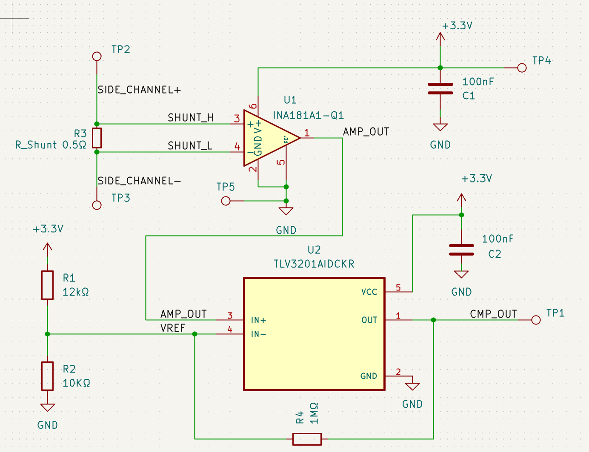
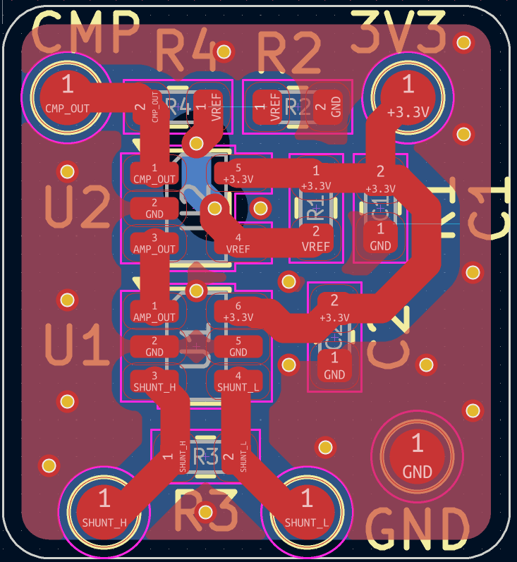
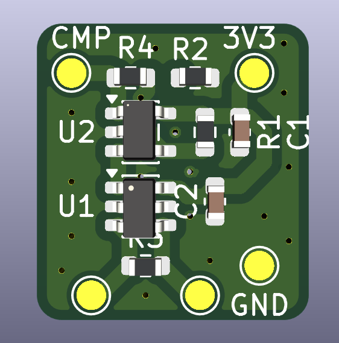

---

# Xbox One Bliss Hack Efuse Side-Channel Current Monitor (INA181 + TLV3201)

# *THIS IS COMPLETELY UNTESTED AND WAS CREATED WITH LOADS OF HELP USE AS A REFERENCE ONLY*

## Hardware

### Schematic


### PCB Layout


### PCB Render


This project implements a small analog front-end designed to detect short current spikes on a low-voltage rail and convert them into a clean digital timing signal suitable for capture by a microcontroller.

The circuit measures current through a shunt resistor, amplifies the resulting voltage drop, and feeds the signal into a high-speed comparator that generates a logic pulse.

The digital output can be captured by a microcontroller (for example a **Teensy**) for precise timing measurements.

---

# How It Works

## 1. Current Sensing

A low-value shunt resistor is placed in series with the monitored rail.

```
Rshunt ≈ 0.5 Ω
```

Current spikes create a small differential voltage:

```
Vshunt = I × Rshunt
```

Typical observed range:

```
0–100 mV
```

---

## 2. Signal Amplification

An **INA181A1 current sense amplifier** measures the voltage across the shunt and amplifies it.

Gain:

```
20 V/V
```

Example amplified output:

| Shunt Voltage | Amplified Output |
| ------------- | ---------------- |
| 25 mV         | 0.5 V            |
| 50 mV         | 1.0 V            |
| 75 mV         | 1.5 V            |
| 100 mV        | 2.0 V            |

Amplifier output net:

```
AMP_OUT
```

---

## 3. Threshold Detection

The amplified signal is fed into a **TLV3201 high-speed comparator**.

```
IN+  → AMP_OUT
IN−  → VREF
```

A resistor divider generates the threshold voltage:

```
VREF ≈ 1.5 V
```

When the amplified signal exceeds this threshold, the comparator outputs a digital signal.

Output net:

```
CMP_OUT
```

---

## 4. Comparator Hysteresis

A feedback resistor introduces small hysteresis to prevent noise from causing repeated triggers.

```
CMP_OUT → 1MΩ → VREF
```

This stabilizes switching while maintaining high timing accuracy.

## Voltage Levels and Threshold Behavior

Two different voltages exist in this circuit:

1. **Rail voltage** being monitored  
2. **Small differential voltage across the shunt resistor**

Typical operating conditions:

- Rail baseline: **0.9–1.0 V**
- Shunt signal: **0–100 mV**
- Amplifier: **INA181A1 (20 V/V gain)**
- Comparator supply: **3.3 V**

---

### Differential Measurement

The INA181 measures only the **voltage difference across the shunt**:


Vshunt = SHUNT_H − SHUNT_L


The rail voltage itself is the **common-mode level**, while the shunt voltage is the signal being amplified.

---

### Amplifier Output

With the INA181A1:


Vout = 20 × Vshunt


Example outputs:

| Vshunt | AMP_OUT |
|------:|--------:|
| 25 mV | 0.5 V |
| 50 mV | 1.0 V |
| 75 mV | 1.5 V |
| 100 mV | 2.0 V |

---

### Comparator Threshold

A resistor divider generates the reference voltage:


3.3V --- R1 --- VREF --- R2 --- GND

VREF = 3.3 × (R2 / (R1 + R2))


With:

- **R1 = 12 kΩ**
- **R2 = 10 kΩ**


VREF ≈ 1.5 V


---

### Equivalent Shunt Threshold

Because the amplifier gain is **20×**, the comparator threshold corresponds to:


Vshunt_threshold = VREF / 20

Vshunt_threshold ≈ 75 mV


---

### Summary

With the current component values:

- **INA181A1 gain:** 20×  
- **Comparator threshold:** ~1.5 V  
- **Shunt trigger level:** ~75 mV  

The rail voltage (~0.9 V) acts only as the **common-mode input**, while switching behavior depends on the **differential shunt signal**.

---

# Signal Chain

```
Current spike
   │
   ▼
Shunt resistor (0.5Ω)
   │
   ▼
INA181 current sense amplifier
   │
   ▼
Amplified analog signal (AMP_OUT)
   │
   ▼
TLV3201 comparator
   │
   ▼
Digital pulse (CMP_OUT)
   │
   ▼
Microcontroller timing capture
```

---

# Hardware Notes

* Supply voltage: **3.3 V**
* Amplifier gain: **20 V/V**
* Shunt resistor: **0.5 Ω**
* Comparator hysteresis resistor: **1 MΩ**
* Decoupling capacitors: **100 nF**

### Layout Guidelines

* Place the **INA181 close to the shunt resistor**
* Use **short differential traces** for the shunt sense inputs
* Keep comparator input traces short

---


---

# Credits

The PCB layout was created by another contributor.

This repository contains the schematic, design files, and documentation for the circuit.

---

